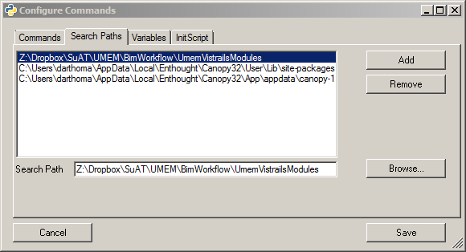

# Search Paths

You can use the *Search Paths* tab of the *Configure Commands* dialog to specify additional locations that will be searched when importing modules.

The *Add* button opens a dialog that lets you choose a folder to add. You can edit the selected folder either with the text box or by clicking *Browse...* and choosing a new folder. Use the *Remove* button to remove an entry in the search paths list.

The search paths will be written to the configuration file (FIXME: link to chapter) when the *Configure Commands* dialog is closed with *Save* - clicking *Cancel* will undo any changes you made.

The paths configured in the *Search Paths* tab are added to `sys.path` whenever an interactive shell is opened or an external script is executed.

**NOTE**: The directory an external script resides in is automatically added to the search paths when that external script is run from the Ribbon. This makes it easier to split your code into a "library" portion and a "gui" portion and thus have re-usable code in your scripts.

* FIXME: rename the dialog to *Configure* or *Preferences*
* FIXME: rename the *Commands* tab to *external scripts* (or come up with a better name...)